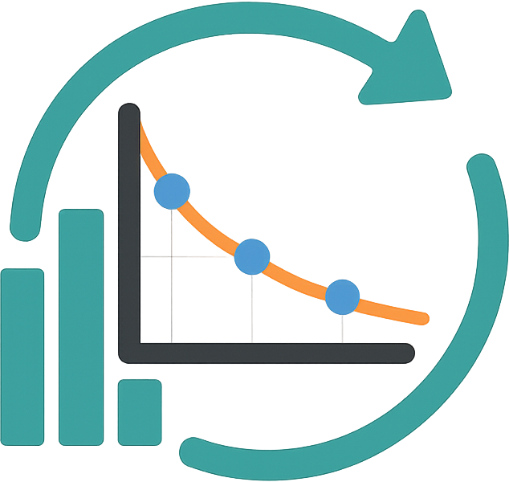
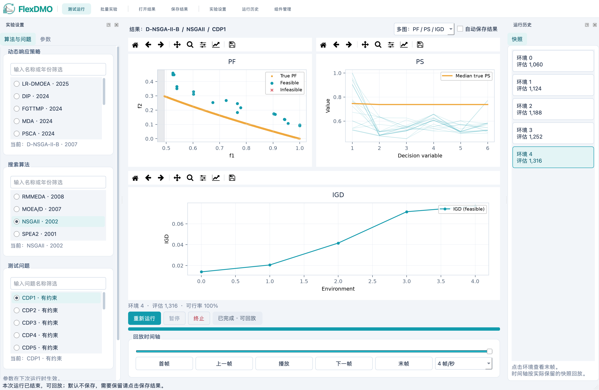
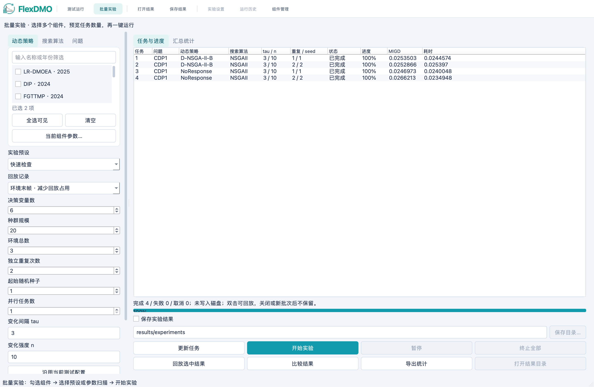
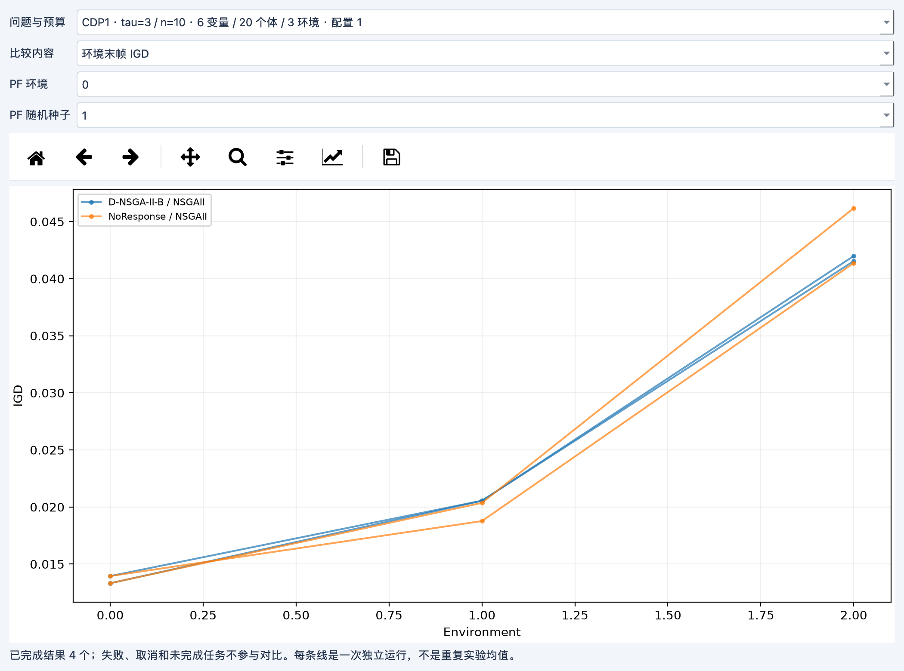

<div align="center">
  
  <h1>FlexDMO</h1>
  <p><strong>动态多目标优化实验平台</strong></p>
  <p>组合算法 · 观察演化 · 回放过程 · 对比实验</p>
  <p>
    <a href="https://github.com/Xieliuliuliu/FlexDMO/actions/workflows/tests.yml"></a>
    <a href="LICENSE"></a>
    <a href="https://flexdmo.cn"></a>
  </p>
  <p>
    <a href="#快速开始">快速开始</a> ·
    <a href="https://flexdmo.cn">使用文档</a> ·
    <a href="flexdmo_app/CODE_API.md">算法接入</a> ·
    <a href="https://github.com/Xieliuliuliu/FlexDMO/issues">问题反馈</a>
  </p>
  <p>简体中文 · <a href="README.en.md">English</a></p>
</div>

FlexDMO 面向动态多目标优化研究，将**搜索算法、环境响应策略和测试问题**分开配置。
在同一工作区观察环境变化后的种群恢复过程，回看不同环境的解集，并安排多组合、多种子的重复实验。



*真实桌面运行：D-NSGA-II-B / NSGA-II / CDP1。截图使用小规模演示配置，不代表算法性能结论。*

## 核心能力

| 能力 | 使用方式 |
| --- | --- |
| 模块化实验 | 独立选择搜索算法、响应策略与问题，切换组件时保留参数 |
| 运行观察与回放 | PF、PS、IGD、CV 多图同步，按环境或时间轴回看，支持暂停、继续与终止 |
| 批量实验与对比 | 多选组件、扫描参数、安排重复种子，查看曲线、前沿与汇总统计 |
| Python 代码扩展 | 直接导入实现 `step` 或 `response` 的 Python 文件，参数从签名读取 |

约束问题区分可行解与不可行解；问题提供的二维不可行域用灰色背景标示。
窗口变窄时图表纵向排列，设置和历史面板可隐藏或浮动。

<details>
<summary><strong>查看批量实验与结果对比</strong></summary>

### 批量实验

选择组件与参数范围，预览任务数量，再统一运行。测试页与批量页使用同一个组件选择器，
算法按年份从新到旧排列；同次重复的各组合使用相同随机种子。



### 结果对比

按相同问题参数和预算分组，查看环境末帧 IGD、可行率、同环境 PF 与重复 MIGD。
每条曲线保留单次运行身份，不把演示结果当作论文结论。



[完整实验说明](docs/usage.md#批量实验与对比)

</details>

## 快速开始

先克隆仓库：

```bash
git clone https://github.com/Xieliuliuliu/FlexDMO.git
cd FlexDMO
```

<details open>
<summary><strong>macOS · Python 3.12</strong></summary>

```bash
python3.12 -m venv .venv
.venv/bin/python -m pip install --only-binary=:all: -r requirements-macos.txt
.venv/bin/python main.py
```

安装后也可双击 `Start-FlexDMO.command`。

</details>

<details>
<summary><strong>Windows · Python 3.10 / PowerShell</strong></summary>

```powershell
py -3.10 -m venv .venv
.\.venv\Scripts\python.exe -m pip install -r requirements.txt
.\.venv\Scripts\python.exe main.py
```

</details>

Linux 安装、系统图形库及算法额外依赖见[安装指南](docs/installation.md)。
基础环境不要求 PyTorch 或 scikit-learn；需要 DIP、RNN、FGTTMP 或 PSCA 时，按对应算法提示安装。

启动后使用默认的 `D-NSGA-II-B / NSGAII / CDP1`，点击“开始运行”。
这是一组用于熟悉操作的小规模配置；正式实验请设置问题规模、环境变化参数和重复次数。
结果可在当前会话回放，需要留档时使用“保存结果”或导出统计。

## 内置算法与问题

### 搜索算法

| 算法 | 年份 | 方法 | 原始文献 |
| --- | --- | --- | --- |
| [RM-MEDA](algorithms/search_algorithm/RMMEDA) | 2008 | 基于规律模型的分布估计 | [IEEE TEVC](https://doi.org/10.1109/TEVC.2007.894202) |
| [MOEA/D](algorithms/search_algorithm/MOEAD) | 2007 | 目标分解与邻域搜索 | [IEEE TEVC](https://doi.org/10.1109/TEVC.2007.892759) |
| [NSGA-II](algorithms/search_algorithm/NSGA2) | 2002 | 非支配排序与拥挤距离 | [IEEE TEVC](https://doi.org/10.1109/4235.996017) |
| [SPEA2](algorithms/search_algorithm/SPEA2) | 2001 | 强度适应度与外部档案 | [ETH TIK Report 103](https://sop.tik.ee.ethz.ch/publicationListFiles/zlt2001a.pdf) |

### 环境响应策略：部分文献实现

| 策略 | 年份 | 方法 | 原始文献 |
| --- | --- | --- | --- |
| [LR-DMOEA](algorithms/response_strategy/LRDMOEA) | 2025 | 关键点相关性与线性回归预测 | [Algorithms](https://doi.org/10.3390/a18060372) |
| [FGTTMP](algorithms/response_strategy/FGTTMP) | 2024 | 反馈引导迁移与趋势流形预测 | [IEEE TSMC: Systems](https://doi.org/10.1109/TSMC.2024.3443143) |
| [PSCA](algorithms/response_strategy/PSCA) | 2024 | 联合子空间与相关性对齐 | [Complex & Intelligent Systems](https://doi.org/10.1007/s40747-024-01369-4) |
| [PPS](algorithms/response_strategy/PPS) | 2014 | 种群中心与流形预测 | [IEEE TCYB](https://doi.org/10.1109/TCYB.2013.2245892) |

另提供 D-NSGA-II-A/B、DIP、MDA、MDP、RNN 和 NoResponse 基线。
[算法目录与适配说明](docs/algorithms.md)区分原始方法、平台组件和实现约定。

测试问题包括 DF、FDA、dMOP、DP、F、HE、JY、UDF，以及项目自定义的 CDP1–CDP6 动态约束套件。
策略以可组合组件接入，论文方法的完整复现仍需核对原文参数、搜索算子、评价预算与实验设置。

## 接入自己的算法

将下面代码保存为 `MySearch.py`，在“组件管理”中作为搜索算法导入：

```python
import numpy as np

def step(population, problem, scale: float = 0.05):
    if scale < 0:
        raise ValueError("scale must be non-negative")
    X = population.get_decision_matrix()
    noise = np.random.normal(0, scale, X.shape) * (problem.xu - problem.xl)
    return np.clip(X + noise, problem.xl, problem.xu)
```

这是接口示例，不含精英选择。搜索组件返回完整下一代，平台负责初始化、评价、
环境切换、运行控制和快照。响应策略使用 `response(population, problem, ...)`；
普通类和完整优化循环也可接入，无需额外编写注册 JSON。

[算法接口](flexdmo_app/CODE_API.md) · [更多示例](flexdmo_app/examples) · [组件目录说明](flexdmo_app/plugins/README.md)

## 文档与参与

| 内容 | 入口 |
| --- | --- |
| 安装、平台环境与额外依赖 | [安装指南](docs/installation.md) |
| 测试、回放、批量实验与数据保留 | [使用手册](docs/usage.md) |
| 内置策略的出处与适配约定 | [算法说明](docs/algorithms.md) |
| 自定义算法接口 | [代码 API](flexdmo_app/CODE_API.md) |
| 贡献、测试与问题反馈 | [贡献指南](CONTRIBUTING.md) |
| 版本变更 | [更新记录](CHANGELOG.md) |

欢迎通过 [Issues](https://github.com/Xieliuliuliu/FlexDMO/issues) 反馈可复现问题，
或通过 Pull Request 改进算法、测试和文档。
当前以源码启动；实机交互检查主要覆盖 macOS，Linux CI 覆盖算法与离屏界面回归。
高维 PF 目前显示二维投影，HV 仅支持二维，统计不自动执行显著性检验。

## 引用与许可

研究中使用 FlexDMO 时，请注明[仓库地址](https://github.com/Xieliuliuliu/FlexDMO)、
使用的 Git 提交或版本，以及所用算法的原始论文。代码版本和实验配置应随结果一同记录。

项目采用 [Apache License 2.0](LICENSE)。第三方依赖遵循各自许可证，分发时需同时核对。
联系：[xiejinsong@whu.edu.cn](mailto:xiejinsong@whu.edu.cn) · [hyhhyh@whu.edu.cn](mailto:hyhhyh@whu.edu.cn)
